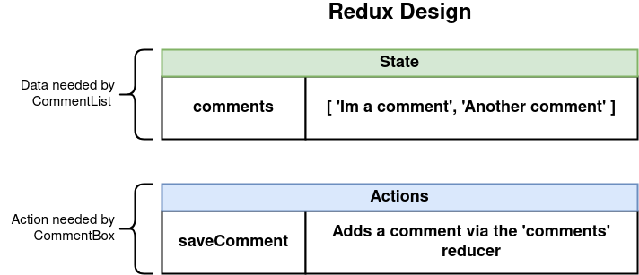
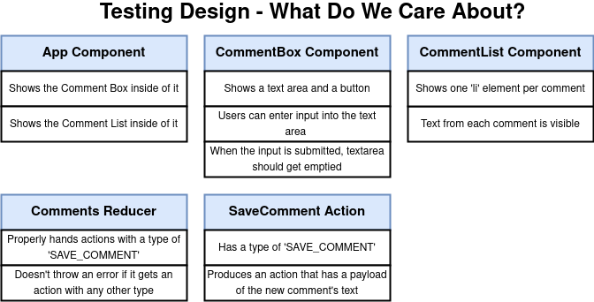
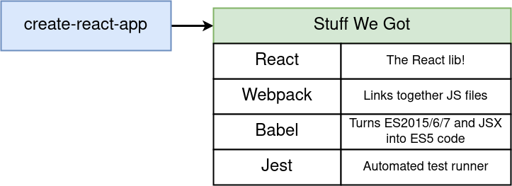
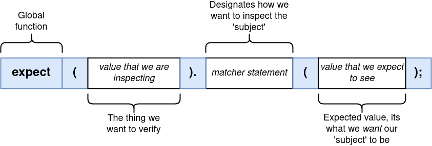
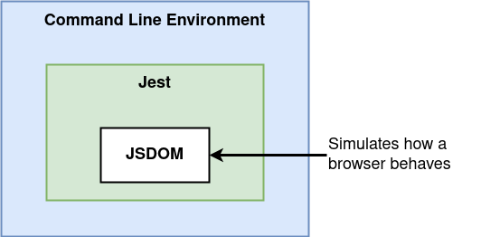
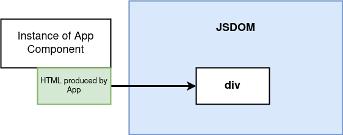
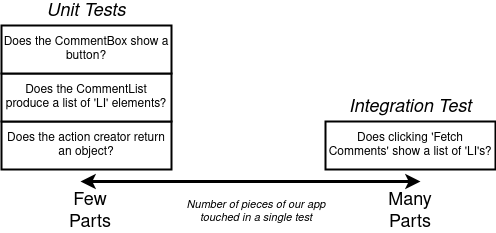
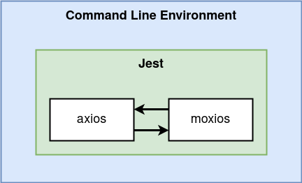
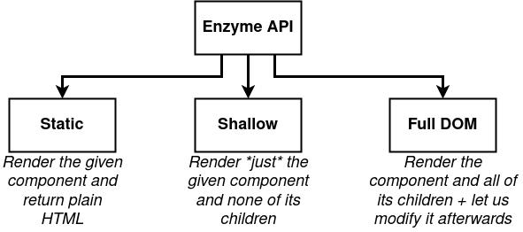
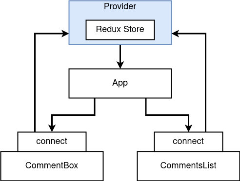

# Testing Input Comments Form - React Redux App


[DEMO](https://tom2kota.github.io/react-redux-form-middleware/)


 

----------

 

----------

 

----------

 

----------

 

----------

 

----------

 

----------

 

----------

 

-----------


 


----------


## [Moxios](https://www.npmjs.com/package/moxios)

###### Mock axios requests for testing.

----------

 

----------

 

----------


```
npm i moxios --save-dev
```

Example:

```
import axios from 'axios'
import moxios from 'moxios'
import sinon from 'sinon'
import { equal } from 'assert'
 
describe('mocking axios requests', function () {
 
  describe('across entire suite', function () {
 
    beforeEach(function () {
      // import and pass your custom axios instance to this method
      moxios.install()
    })
 
    afterEach(function () {
      // import and pass your custom axios instance to this method
      moxios.uninstall()
    })
 
    it('specify response for a specific request', function (done) {
      let input = document.querySelector('.UserList__Filter__Input')
      let button = document.querySelector('.UserList__Filter__Button')
 
      input.value = 'flintstone'
      button.click()
 
      // Elsewhere in your code axios.get('/users/search', { params: { q: 'flintstone' } }) is called
 
      moxios.wait(function () {
        let request = moxios.requests.mostRecent()
        request.respondWith({
          status: 200,
          response: [
            { id: 1, firstName: 'Fred', lastName: 'Flintstone' },
            { id: 2, firstName: 'Wilma', lastName: 'Flintstone' }
          ]
        }).then(function () {
          let list = document.querySelector('.UserList__Data')
          equal(list.rows.length, 2)
          equal(list.rows[0].cells[0].innerHTML, 'Fred')
          equal(list.rows[1].cells[0].innerHTML, 'Wilma')
          done()
        })
      })
    })
 
    it('stub response for any matching request URL', function (done) {
      // Match against an exact URL value
      moxios.stubRequest('/say/hello', {
        status: 200,
        responseText: 'hello'
      })
 
      // Alternatively URL can be a RegExp
      moxios.stubRequest(/say.*/, {/* ... */})
 
      let onFulfilled = sinon.spy()
      axios.get('/say/hello').then(onFulfilled)
 
      moxios.wait(function () {
        equal(onFulfilled.getCall(0).args[0].data, 'hello')
        done()
      })
    })
 
  })
 
  it('just for a single spec', function (done) {
    moxios.withMock(function () {
      let onFulfilled = sinon.spy()
      axios.get('/users/12345').then(onFulfilled)
 
      moxios.wait(function () {
        let request = moxios.requests.mostRecent()
        request.respondWith({
          status: 200,
          response: {
            id: 12345, firstName: 'Fred', lastName: 'Flintstone'
          }
        }).then(function () {
          equal(onFulfilled.called, true)
          done()
        })
      })
    })
  })
 
})
```

------------

## [Enzyme](https://www.npmjs.com/package/enzyme)

###### Enzyme is a JavaScript Testing utility for React that makes it easier to test your React Components' output. You can also manipulate, traverse, and in some ways simulate runtime given the output.


----------

 


----------

```
npm i --save-dev enzyme enzyme-adapter-react-16
```

setupTests.js

```
import Enzyme from "enzyme";
import Adapter from "enzyme-adapter-react-16";

Enzyme.configure({adapter: new Adapter()})
```


[Shallow Rendering API](https://enzymejs.github.io/enzyme/docs/api/shallow.html#shallow-rendering-api)


----------

## Absolute Imports:

**webpack** is using  ``` src ``` folder as the first lookup location instead of ``` node_modules ``` (default)

Now when you need to move this file, your import statements won’t break! 

An added bonus is that it looks much cleaner, and helps people that are new to your codebase have a clearer understanding of how your project is organized.

adding a ```jsconfig.json``` file to the root of your project (where ```package.json``` is) and instruct **webpack** to use ```src``` as the lookup reference


[.env](https://www.digitalocean.com/community/tutorials/react-clean-import-statements-in-react)
```
NODE_PATH=src/
```

[jsconfig.json](https://www.digitalocean.com/community/tutorials/react-clean-import-statements-in-react)

``` 
{
  "compilerOptions": {
    "baseUrl": "src"
  }
}
```

Your project will now use absolute imports in development, and production builds.


### Testing


----------

 


Redux error for CommentBox component:

``` 
  Could not find "store" in the context of "Connect(CommentBox)". Either wrap the root component in a <Provider>, or pass a custom React context provider to <Provider> and the corresponding React context consumer to Connect(CommentBox) in connect options.
```

Issue1:

before CommentBox.test.js:
``` 
import CommentBox from "components/CommentBox";
beforeEach(() => wrapped = mount(<CommentBox/>))
```


after CommentBox.test.js:
``` 
import CommentBox from "components/CommentBox";
import {createStore} from "redux;
import {Provider} from "react-redux";
import reducers from "reducers";
 
beforeEach(() => wrapped = mount(<Provider store={createStore(reducers, {})}>  <CommentBox/> </Provider>)
```


Issue2:

before CommentBox.test.js:
``` 
import CommentBox from "components/CommentBox";
beforeEach(() => wrapped = mount(<CommentBox/>))
```


after CommentBox.test.js:
``` 
import Root from "Root";
beforeEach(() => wrapped = mount(<Root><CommentBox/></Root>))
```


Issue2 (wrap CommentBox):

before src/index.js
``` 
const composeEnhancers = window.__REDUX_DEVTOOLS_EXTENSION_COMPOSE__ || compose;
const store = createStore(reducers,
    composeEnhancers(applyMiddleware()));

ReactDOM.render(
    <Provider store={store}>
        <App/>
    </Provider>,
    document.querySelector('#root')
)

```

after src/index.js
``` 
import Root from "Root";

ReactDOM.render(
    <Root>
        <App/>
    </Root>,
    document.querySelector('#root')
)

```

after src/Root.js

``` 
import React from "react";
import {Provider} from "react-redux";

import {createStore, applyMiddleware, compose} from "redux";
import reducers from "reducers";

export default (props) => {
    const composeEnhancers = window.__REDUX_DEVTOOLS_EXTENSION_COMPOSE__ || compose;
    const store = createStore(reducers,
        composeEnhancers(applyMiddleware()));
    return (
        <Provider store={store}>
            {props.children}
        </Provider>
    )
}
```


### Validation


----------

[Tiny Validator (for v4 JSON Schema)](https://www.npmjs.com/package/tv4) 


``` 
npm i tv4
```

#### [JSON schema generator](https://jsonschema.net/)

input:
``` 
{
    "comments": ["Comment #1", "Comment #2"],
    "auth": true
}
```

output:
``` 
{
    "$schema": "http://json-schema.org/draft-07/schema",
    "$id": "http://example.com/example.json",
    "type": "object",
    "title": "The root schema",
    "description": "The root schema comprises the entire JSON document.",
    "default": {},
    "examples": [
        {
            "comments": [
                "Comment #1",
                "Comment #2"
            ],
            "auth": true
        }
    ],
    "required": [
        "comments",
        "auth"
    ],
    "additionalProperties": true,
    "properties": {
        "comments": {
            "$id": "#/properties/comments",
            "type": "array",
            "title": "The comments schema",
            "description": "An explanation about the purpose of this instance.",
            "default": [],
            "examples": [
                [
                    "Comment #1",
                    "Comment #2"
                ]
            ],
            "additionalItems": true,
            "items": {
                "anyOf": [
                    {
                        "$id": "#/properties/comments/items/anyOf/0",
                        "type": "string",
                        "title": "The first anyOf schema",
                        "description": "An explanation about the purpose of this instance.",
                        "default": "",
                        "examples": [
                            "Comment #1",
                            "Comment #2"
                        ]
                    }
                ],
                "$id": "#/properties/comments/items"
            }
        },
        "auth": {
            "$id": "#/properties/auth",
            "type": "boolean",
            "title": "The auth schema",
            "description": "An explanation about the purpose of this instance.",
            "default": false,
            "examples": [
                true
            ]
        }
    }
}
```
